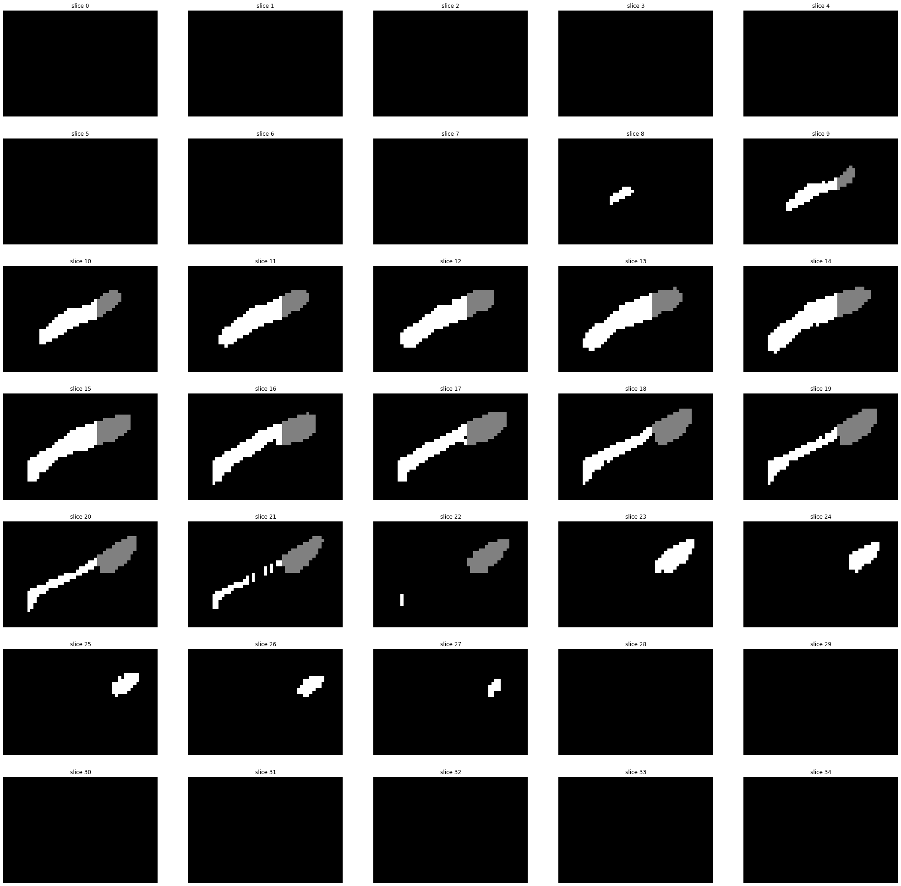

# Validation Plan - HippoCrop_UNet

### Hippocampal Volume Quantification for Alzheimer's Progression Utilizing Segmentation with a Unet Convolutional Neural Network

## Algorithm Description

### 1. General Information

       1.  What is the intended use of the product?

**Intended Use Statement:** 
The HippoCrop_Unet AI algorithm is intended to aid physicians, namely radiologists, by automatic segmentation and quantification of hippocampal tissue in 3-D volume MRI renderings.

The algorithm is intended to help diagnose and track any progression of Alzheimer's Disease and other forms of Dementia in patients displaying ymptoms of disease, including issues with short and long term memory as well as learning.  Quantification will help guide disease management.

### 2. Algorithm Design and Function

**System Design**

The HippoCrop_Unet is an end-to-end AI system which features a machine learning algorithm that integrates into a clinical-grade viewer and automatically measures hippocampal volumes of new patients, as their studies are committed to the clinical imaging archive.  An MRI volume will be pushed to Picture Archive and Communication System (PACS) server over Digital Imagining and Communications in Medicine (DICOM) services.  Each volume will be auto-transferred from the PACS server to an AI server which will screen for volumes designated 'HippoCrop', subsequentially running inference, and returning a results report to the PACS server for viewing through an Open Health Imaging Foundation (OHIF) Viewer.

The OHIF Viewer is a zero-footprint medical image viewer provided by the Open Health Imaging Foundation. It is a configurable and extensible progressive web application with out-of-the-box support for image archives which support DICOMweb.  The PACS server may be simulated with Orthanc, a free, open-source, lightweight DICOM server.

*Figure 1. AI Clinical Radiology Network:*

 

**U-net Architecture:**

We utilize the U-net CNN archtictecture as described by authors in ([U-Net: Convolutional Networks for BiomedicalImage Segmentation, Ronneberger et al, May 2015](https://arxiv.org/pdf/1902.09063.pdf)).

The U-Net differs from a standard CNN arhitecture in that it combines the location information from the downsampling path with the contextual information in the upsampling path.  The purpose of this expanding path is to enable precise localization combined with contextual information from the contracting path.  In the upsampling path, skip layers are added from contraction path, concatenating upsampled layer with the corresponding cropped feature map from the contracting path. The result combines localisation and context necessary to create good segmentation map.  For a deeper understanding, see the webpage on U-net created by one of the authors of the original paper, Olaf Ronneberger([here](https://lmb.informatik.uni-freiburg.de/people/ronneber/u-net/index.html)).

From the original paper:

*Figure 2: U-net Archictecture. Source: U-Net: Convolutional Networks for BiomedicalImage Segmentation, Ronneberger et al, May 2015.

# 

### 4. Databases

    2. How was the training data collected?

**Dataset **

**Collection of Training Data:**
The hippocampus training data was gather from the Medical Decathlon competition, found at http://www.medicaldecathlon.com.   This dataset is stored as a collection of 260 Neuroimaging Informatics Technology Initiative (NIfTI) files, with one file per image volume, and one file per corresponding segmentation mask. The original images are T2 MRI scans of the full brain. This dataset utilizes cropped volumes where the region around the hippocampus has been cut out.  

The following details regarding this dataset acquistion are described here:  ([A large annotated medical image dataset for the development and evaluation of segmentation algorithms, Simpson et al, Feb 2019](https://arxiv.org/pdf/1902.09063.pdf)).  From the paper, 'The dataset consisted of MRI acquired in 90 healthy adults and 105 adults with a non-affective psychotic disorder (56 schizophrenia, 32 schizoaffective disorder, and 17 schizophreniform disorder) taken from the Psychiatric Genotype/Phenotype Project data repository at Vanderbilt University Medical Center (Nashville, TN, USA).' As well, 'Structural images were acquired with a 3D T1-weighted MPRAGE sequence(TI/TR/TE, 860/8.0/3.7 ms; 170 sagittal slices; voxel size, 1.0 mm3). All images were collected on a Philips Achieva scanner (Philips Healthcare, Inc., Best, The Netherlands). Manual tracing of the head, body, and tail of the hippocampus on images was completed following a previously published protocol (see reference). For the purposes of this dataset, the term hippocampus includes the hippocampus proper (CA1-4 and dentate gyrus) and parts of the subiculum, which together are more often termed the hippocampal formation. The last slice of head of the hippocampus was defined as the coronal slice containing the uncal apex. The resulting 195 labeled images are referred to as hippocampus atlases. Note that the term hippocampus posterior refers to the union of the body and the tail.'  

Further, all data were made available online under Creative Commons license CC-BY-SA4.0. The data was reformatted from DICOM to NIfTI, an open standard supported by National Institutes of Health (NIH), and as such doesn't require proprietary software.  This serves to ensure open access, consistency and interoperability.

    **3. How did you label your training data?**
**Labeling of Training Data:**

Medical image segmentation seeks to extract anatomical regions of interest from a medical image or series of images. Semantic segmentation aims to automatically associate each image pixel with a classification label.  The brain tissue was classified as non-hippocampal (background), anterior hippocampal, or posterior hippocampal. 

**Findings **

*Figure 3: Sample slices in 3D-slicer showing axial, sagittal, and coronal views:*

*Figure 4. Sample image depicting Sagittal Slices:* 

*Figure 5. Sample hippocampal segmentation showing anterior and posterior areas:*

#

   
**Splitting the Dataset**

The algorithm was trained by splitting the dataset into train, validation, and test sets.  The data was randomly split resulting in 70% of data for training, and 15% for for each validation and test sets.

### 3. Algorithm Training

We performed out training with the following hyperparameter configuration:
Final_Project
    Loss Function:  CrossEntropyLoss
    Optimizer:  Adam
    Learning Rate:  0.0002
    Batch Size:  8
    Patch Size:  64

Preliminary results are visualized using Tensorboard in the following figures.

*Figure 6. TensorBoard Training Loss:*

 

*Figure 7. TensorBoard Images and Masks:*

 

*Figure 8. TensorBoard Masks and Predictions:*

 

*Figure 9. TensorBoard Predictions and Probability Maps:*

 

    4. How was the training performance of the algorithm measured and how is the real-world performance going to be estimated? 

**Performance Metrics**

The final training performance from the algorithm was measured with the Dice Similarity Coefficient and the Jaccard Index.  These are two formulas that measure how well our predictions overlap with our ground truth.

Given two volumes X and Y,

The Dice Similarity Coefficient (DSC) can be derived as a 2 fold factor of the volume intersection over the sum of volumes:

    X = (X > 0)
    Y = (Y > 0)
    intersection = np.sum(X*Y)
    volumes = np.sum(X) + np.sum(Y)
    if volumes == 0:
        return -1
        
    DSC = 2.*float(intersection) / float(volumes)

The Jaccard Index (JI) can be derived as the intersection of the volumes over the union:

    X = (X > 0)
    Y = (Y > 0)
    intersection = np.sum(X*Y)
    union = np.sum(X) + np.sum(Y) - intersection

    if union == 0:
        return -1

    JI = float(intersection)/float(union)

    
  
Results fo training are seen below in final recorded json file.
  

*Figure 9. JSON Performance Metrics:*

    {
      "volume_stats": [
        {
          "filename": "hippocampus_318.nii.gz",
          "dice": 0.8694209891435465,
          "jaccard": 0.7690050680181382
        },
        {
          "filename": "hippocampus_150.nii.gz",
          "dice": 0.9107251675807434,
          "jaccard": 0.8360839160839161
        },
        {
          "filename": "hippocampus_068.nii.gz",
          "dice": 0.9243956797531288,
          "jaccard": 0.8594198278610137
        },
        {
          "filename": "hippocampus_393.nii.gz",
          "dice": 0.8964670577001773,
          "jaccard": 0.8123609394313968
        },
        {
          "filename": "hippocampus_130.nii.gz",
          "dice": 0.9117997616209773,
          "jaccard": 0.8378970427163198
        },
        {
          "filename": "hippocampus_378.nii.gz",
          "dice": 0.8974267333809864,
          "jaccard": 0.8139384116693679
        },
        {
          "filename": "hippocampus_052.nii.gz",
          "dice": 0.9335163159499847,
          "jaccard": 0.8753217043179868
        },
        {
          "filename": "hippocampus_360.nii.gz",
          "dice": 0.891141764999169,
          "jaccard": 0.8036570743405276
        },
        {
          "filename": "hippocampus_003.nii.gz",
          "dice": 0.8981155201470814,
          "jaccard": 0.8150723025583982
        },
        {
          "filename": "hippocampus_126.nii.gz",
          "dice": 0.9146301726946888,
          "jaccard": 0.8426898829180426
        },
        {
          "filename": "hippocampus_127.nii.gz",
          "dice": 0.911281779661017,
          "jaccard": 0.8370226222330334
        },
        {
          "filename": "hippocampus_268.nii.gz",
          "dice": 0.8868286445012787,
          "jaccard": 0.7966685812751292
        },
        {
          "filename": "hippocampus_216.nii.gz",
          "dice": 0.9200059145349697,
          "jaccard": 0.8518619934282585
        },
        {
          "filename": "hippocampus_305.nii.gz",
          "dice": 0.8252540396468433,
          "jaccard": 0.7024957458876915
        },
        {
          "filename": "hippocampus_180.nii.gz",
          "dice": 0.9276689251052921,
          "jaccard": 0.8650956284153005
        },
        {
          "filename": "hippocampus_162.nii.gz",
          "dice": 0.9278174037089871,
          "jaccard": 0.8653539116551358
        },
        {
          "filename": "hippocampus_340.nii.gz",
          "dice": 0.887797147385103,
          "jaccard": 0.7982331148475349
        },
        {
          "filename": "hippocampus_194.nii.gz",
          "dice": 0.921251719394773,
          "jaccard": 0.8540006375518011
        },
        {
          "filename": "hippocampus_107.nii.gz",
          "dice": 0.9290119406901981,
          "jaccard": 0.8674344523401127
        },
        {
          "filename": "hippocampus_299.nii.gz",
          "dice": 0.8689863842662633,
          "jaccard": 0.7683253076511504
        },
        {
          "filename": "hippocampus_065.nii.gz",
          "dice": 0.9370932754880694,
          "jaccard": 0.8816326530612245
        },
        {
          "filename": "hippocampus_123.nii.gz",
          "dice": 0.905672009864365,
          "jaccard": 0.8276056338028169
        },
        {
          "filename": "hippocampus_181.nii.gz",
          "dice": 0.9206349206349206,
          "jaccard": 0.8529411764705882
        },
        {
          "filename": "hippocampus_276.nii.gz",
          "dice": 0.9207622868605817,
          "jaccard": 0.8531598513011153
        },
        {
          "filename": "hippocampus_158.nii.gz",
          "dice": 0.896837888109887,
          "jaccard": 0.812970168612192
        },
        {
          "filename": "hippocampus_014.nii.gz",
          "dice": 0.8743348342202211,
          "jaccard": 0.7767272727272727
        },
        {
          "filename": "hippocampus_238.nii.gz",
          "dice": 0.9190988223246288,
          "jaccard": 0.8503079109426812
        },
        {
          "filename": "hippocampus_094.nii.gz",
          "dice": 0.9347963173161811,
          "jaccard": 0.8775751835188255
        },
        {
          "filename": "hippocampus_039.nii.gz",
          "dice": 0.9221340019501323,
          "jaccard": 0.8555182217627294
        },
        {
          "filename": "hippocampus_096.nii.gz",
          "dice": 0.9224852071005917,
          "jaccard": 0.85612300933553
        },
        {
          "filename": "hippocampus_075.nii.gz",
          "dice": 0.9018445322793149,
          "jaccard": 0.8212357528494301
        },
        {
          "filename": "hippocampus_308.nii.gz",
          "dice": 0.9360957890488363,
          "jaccard": 0.879868487607486
        },
        {
          "filename": "hippocampus_044.nii.gz",
          "dice": 0.9197894084855992,
          "jaccard": 0.8514908256880734
        },
        {
          "filename": "hippocampus_088.nii.gz",
          "dice": 0.9075329326000767,
          "jaccard": 0.8307188012175135
        },
        {
          "filename": "hippocampus_250.nii.gz",
          "dice": 0.9193620509763005,
          "jaccard": 0.8507586206896551
        },
        {
          "filename": "hippocampus_328.nii.gz",
          "dice": 0.9318269354217487,
          "jaccard": 0.8723557692307692
        },
        {
          "filename": "hippocampus_007.nii.gz",
          "dice": 0.9263341067285383,
          "jaccard": 0.8627768773635872
        },
        {
          "filename": "hippocampus_042.nii.gz",
          "dice": 0.8322307488753639,
          "jaccard": 0.7126671198731022
        },
        {
          "filename": "hippocampus_249.nii.gz",
          "dice": 0.9279416235937975,
          "jaccard": 0.8655700510493477
        }
      ],
      "overall": {
        "mean_dice": 0.9079577116344708,
        "mean_jaccard": 0.8324087577513897
      }
    }
    

 
### 4. Algorithm Performance Standard

**Clinical Significance and Ground Truth**

Resutling segmentation and quanitification by the AI algorithm will serve to guide radiologists given the performance metric of correct overlap as described above.  Radiologists should be the final arbiters to verify the results of the algorithm.

For example, previous research has shown xxxx and one would expect ranges of measurement to be commensurate given any factoring for necessary disease states. 

Hippocampal volume across age: Nomograms derived from over 19,700 people in UK Biobank, Nobis et al, 2019
https://www.sciencedirect.com/science/article/pii/S2213158219302542#f0005

*Figure 10. Hippocampal Quantification Metrics:*
https://www.sciencedirect.com/science/article/pii/S2213158219302542#f0005

 

**Device Limitations:**

*Algorithmic Limitations*:

Patient History and Demographics:  This algorithm was not specifically tested on those with a prior history of brain illness, including neurological illness, head injury, or substance abuse dependence. Racial or ethnic demographics as well are not noted in the dataset so any differential performance in this regard is unknown.

*Computational Limitations*:

Model training as well as testing and inference was performed utilizing an Nvidia RTX 2060 GPU with 6GB of onboard RAM. It is suggested to utilize HippoCrop_Unet on a system with comparable hardware.

